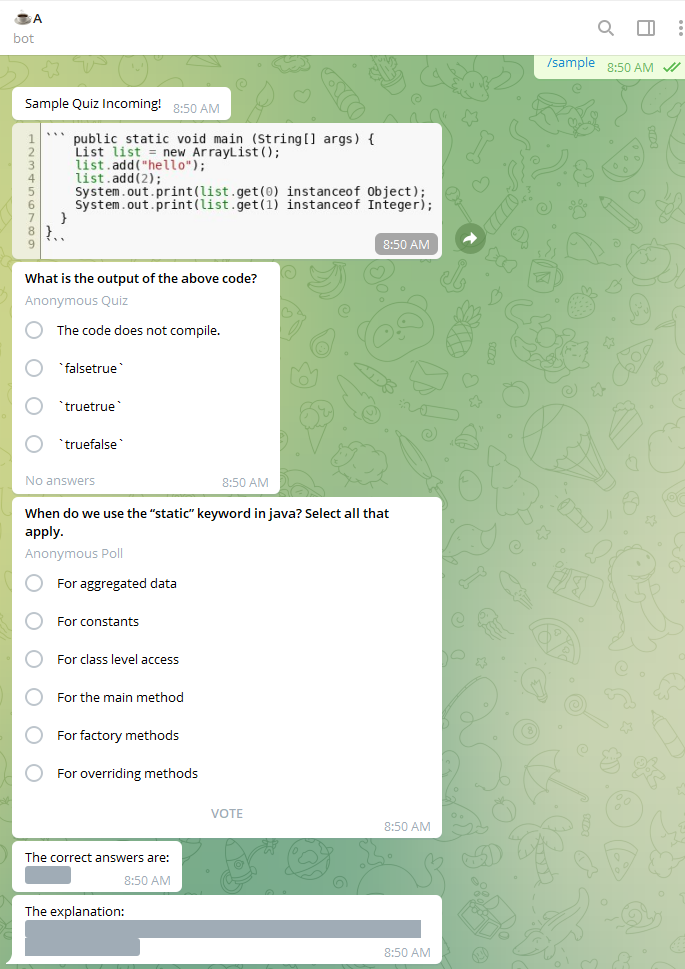
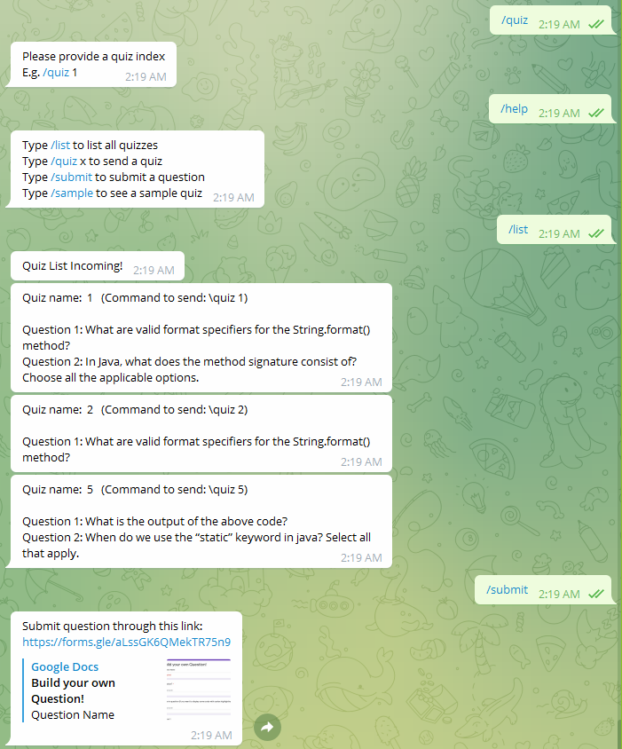

  

## Tea A Bot
Team
- Jun Xiong
- Yongliang

HACK AND ROLL!!!
## Usage
- Go to Telegram and chat with @teaabot_bot
- Or, add @teaabot_bot to your Telegram group
## Demo

## Inspiration
As undergrad TAs (teaching assistants) we feel that it is very important to keep students engaged in the learning process. One of the methods to engage students is to ask them questions, and what better way to achieve this than by automating it using a Telegram bot! 

Over the past semesters, we manually created weekly quizzes for students to answer on Telegram. While we are grateful that students appreciate the ease and simplicity of these quizzes showing up as a Telegram anonymous poll or quiz, there were a few pain points that we found.
- The manual process of creating the quiz questions via the Telegram poll creation interface was tedious.
- The code snippets were not formatted in a way that would allow students to easily see the code. (Telegram does not do markdown code formatting properly)
- For questions that allow multiple answers, Telegram polls do not have a way to display the correct answer and explanation after a user voted. (This is possble in Telegram quiz, which is similar to Telegram poll but only allows single-answer questions.)

So just before we begin another busy semester, we decided to create a Telegram bot that would automate the processes and address these pain points.
## What it does
Our bot houses a library of questions (created or hand-picked by us) from which the quizzes are made up of. All TAs have to do is to add the bot to their teaching Telegram group and voilà. It just works. With a simple command, a TA can send out a quiz to the group, and repeat the process for every week.

Currently, the bot supports two types of questions:
- Multiple choice questions (MCQ)
- Multiple response questions (MRQ) - can have multiple correct answers

Both type of questions can have a code snippet that the bot will render as a syntax highlighted code snippet image (currently only supports Java).
For MRQ, the correct answer and explanation will be sent as a message with spoiler tags. This is to allow students to check the answer after they attempted the quiz. Note that the spoiler tags are Telegram features that require the latest version of the Telegram client (December 2021 and beyond).

Currently, the bot is intended for usage with the following modules:
- CS2030/S
## Functions
- `/help` - brings up a list of available commands and their descriptions
- `/intro` - sends an introduction about the weekly quizzes
  - restricted to people with admin access only
- `/list` - lists all the quizzes
  - mainly for admins to check what quizzes and questions are available
- `/quiz [quiz_name]` - sends the quiz with quiz name specified
  - e.g. `/quiz 1`
  - restricted to people with admin access only - this is so that only TAs can trigger the quiz every week
  - interested TAs can chat with us to become admins!
- `/sample` - sample question to see how the bot sends the quiz
  - since the quiz sending command is restricted to admins, this is a way to see how the bot works
- `/about` - sends the author information
- `/submit` - propose a question via Google form

## Flow
1. The bot is deployed in the cloud and will be available after a command is issued to it.
2. Users either direct chat or add the bot into a Telegram group to interact with it.
3. Admins can send a specific command to the bot for various purposes.
4. The bot will respond to the quiz command and send a series of quiz questions to the chat or Telegram group.
5. The user can answer the quiz questions just like any other Telegram poll or quiz.

## User Stories
- As an admin, I want a command to trigger the bot to send out quiz questions into the group.
- As an admin, I want a way to store the quiz questions in the backend.
- As an admin, I want a way to organize the questions into weeks.
- As a user, I want to be able to view any code snippets in the quiz with syntax highlighting.
- Bonus: as a user, I want to propose a question to the bot for consideration.
## How we built it
We built this app with a python backend and hosted it on Heroku

## Challenges we ran into
- Reading the bad documentation that plagues most python libraries 
- How to host it for free so that the bot can live forever
- How to make syntax highlighted images that will display any code snippets in the question
## Accomplishments that we're proud of
We are actually going to put this bot into use in the coming semester. We hope that our students will enjoy the bot and the way it works. That, will be seriously satisfying accomplishments:)
## What we learned
Telegram truly is a powerful tool and their APIs enable many possibilities.

## What's next for Tea A Bot
More features:
- Support for multiple modules
- Support for more question types (possibly open-ended)
- Support for out of telegram quiz library UI
- Make the bot cooler with inline keyboard and beautiful menus
- Make the bot accept a question proposal via Telegram
- Automate the quiz sending process to trigger every week (via cron job)
## Development
1. git clone the repository (either via GitHub desktop or CLI)
2. change to project directory
 - `cd teaa_bot` 
3. create virtual environment
 - `python3 -m venv venv # If not created, creating virtualenv`
4. activate virtual environment
 - Windows: `venv\Scripts\activate.bat`
 - Mac: `source ./venv/bin/activate # Activating virtualenv`
 - (Better) using VSCode, select the python interpreter within the `venv` folder and the above is done automatically
5. install dependencies
 - `pip3 install -r ./requirements.txt # Installing dependencies`
6. to update requirements after adding or removing dependencies
 - `pip freeze > requirements.txt`
## Commands
- To re-deploy: `git push heroku main` (For the one with the hosting account)
- To start the bot locally: `python bot.py`
## Reference
- [Creating a Telegram Chatbot Quiz with Python](https://towardsdatascience.com/creating-a-telegram-chatbot-quiz-with-python-711a43c0c424)
- [Bring your Telegram Chatbot to the next level](https://towardsdatascience.com/bring-your-telegram-chatbot-to-the-next-level-c771ec7d31e4)
- [Deployment](https://towardsdatascience.com/how-to-deploy-a-telegram-bot-using-heroku-for-free-9436f89575d2)
- [python-telegram-bot on Heroku](https://github.com/Bibo-Joshi/ptb-heroku-skeleton)

## Tools
- [escape markdown code strings before adding into quiz JSON](https://www.freeformatter.com/json-escape.html#ad-output)
